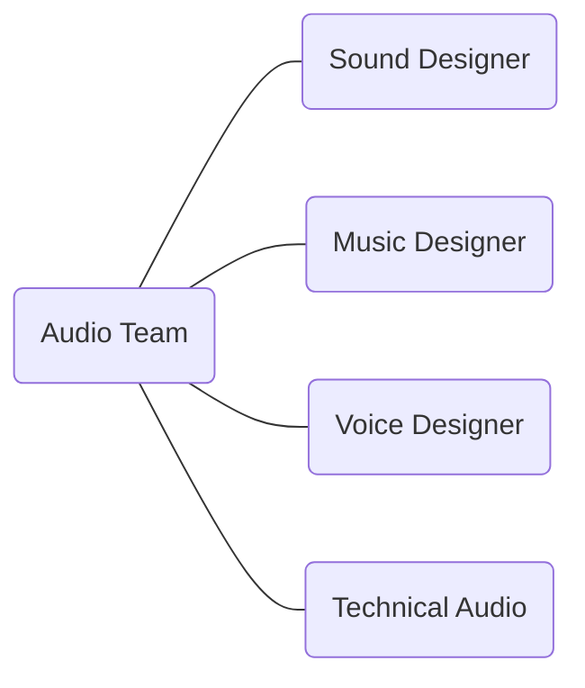

## 开发流程
**Dev Workflow**

---
layout: header-body-center
---

### 开发阶段 Dev Stage

::body::

```mermaid {theme: 'base', scale: '0.5', themeVariables:{fontSize: '24px', primaryTextColor: '#fff',primaryColor: '#a6a6a6'}}
timeline
  section CONCEPT 原型
    Brainstorm : An iterative development spiral, to take risks, try and fail, test and refine vision.
    Approval : Formal evaluation and greenlighting of the concept to proceed to preproduction.
  section PREPRODUCTION 预研
    First Playable : The earliest functional prototype demonstrating core gameplay mechanics.
    Vertical Slice : A polished segment of the game showcasing key features, visual fidelity and mechanics.
  section PRODUCTION 开发
    Alpha Test : An internal test phase focusing on core functionality and major features.
    Closed Beta Test : A limited external test to gather feedback and identify issues before wider release.
    Open Beta Test : A public test phase to assess scalability, stability, and final gameplay refinements.
  section OPERATION 上线
    Release : The official launch of the game to the public.
    Long-term operation : Ongoing content updates, bug fixes, and community engagement to sustain the game.
```

<!--
https://www.ubisoft.com/en-us/company/how-we-make-games/creative-process
-->

---
layout: header-body
---

### 开发团队 Dev Team
中台化的音频团队？

::body::

```mermaid {theme: 'base', scale: '1', themeVariables:{fontSize: '16px', primaryTextColor: '#fff',primaryColor: '#828181', 'lineColor': '#fff'}}
graph TD
  root(Game Studio) --- A(Project A)
    A --- A1(Director)
    A --- A2(PM)
    A --- A3(Programmer)
    A --- A4(Designer)
    A --- A5(Artist)
  root --- B(Project B)
  root --- C(Project C)
  root ---- D(Audio Team)
  root ---- E(Others)
style D fill:#173d03, stroke:#fff, stroke-width:1px
```

<!--
音频组在什么位置？
音频会跟各个工种和模块打交道：材质、动画、特效、关卡……
-->

---
layout: header-body
---

### 音频团队 Audio Team

::body::



<!--
- 音频组内部的分工形式
- 技术音频是什么
- 怎么成为 Lead Audio Designer
-->

---
layout: header-body-center
---

### 音频数据 Audio Data
根据**设计需求**制作出相应的**音频数据**，并将其整合到游戏引擎中去，与其它设计元素共同形成最终整体的**游戏表现**。

::body::


<!--
- 在做出好听的声音之外，还有考虑其他的问题
- 既有艺术创作方面的制作能力，还有技术思维方面的实现能力。
-->

---
layout: header-body-center
---

### 设计流程 Design Workflow

::body::


<!--
- 游戏音频设计工作流，包含前期设计、功能开发、资源制作、数据整合与测试优化等环节的迭代式开发流程
- 围绕 placeholder 讲讲具体的开发过程，体现迭代的特点
-->

---
layout: statement
---

#### 游戏开发是系统工程，游戏音频设计也应如此。
Game development is like systems engineering, and so is game audio design.

<!--  -->