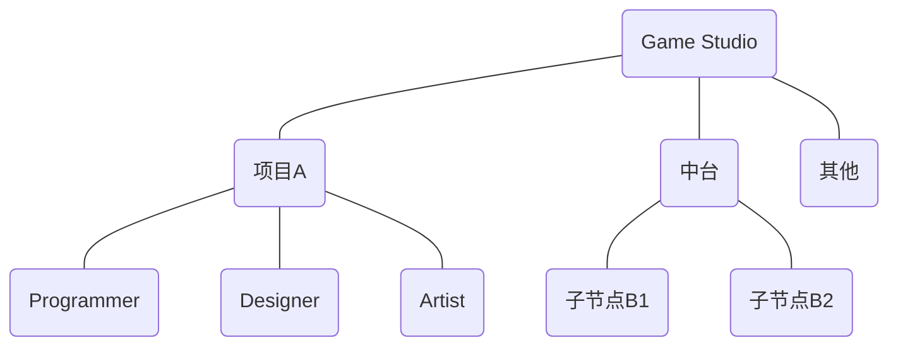
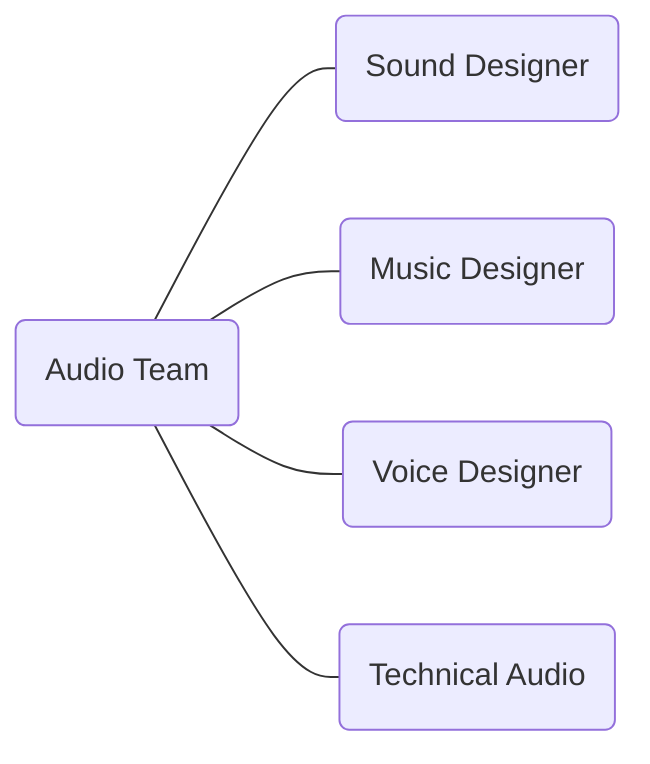

## 开发流程
**Dev Workflow**

---
layout: header-body
---

### <span class="text-red-500">游戏</span>
开发阶段 Dev Stage

::body::

```mermaid {theme: 'neutral', scale: '0.6'}
gantt
```
<!--
https://www.ubisoft.com/en-us/company/how-we-make-games/creative-process
-->

---
layout: header-body
---

### <span class="text-red-500">游戏</span>
开发团队 Dev Team

::body::



<!--
音频组在什么位置
音频会跟各个工种和模块打交道：材质、动画、特效、关卡……
-->

---
layout: header-body
---

### <span class="text-red-500">游戏</span>
音频团队 Audio Team

::body::



<!--
- 音频组内部的分工形式
- 技术音频是什么
- 怎么成为 Lead Audio Designer
-->

---
layout: header-body-center
---

### <span class="text-green-500">音频</span>
根据**设计需求**制作出相应的**音频数据**，并将其整合到游戏引擎中去，与其它设计元素共同形成最终整体的**游戏表现**。

::body::


<!--
- 在做出好听的声音之外，还有考虑其他的问题
- 既有艺术创作方面的制作能力，还有技术思维方面的实现能力。
-->

---
layout: header-body
---

### <span class="text-blue-500">设计</span>
Design Workflow

::body::


<!--
- 游戏音频设计工作流，包含前期设计、功能开发、资源制作、数据整合与测试优化等环节的迭代式开发流程
- 围绕 placeholder 讲讲具体的开发过程，体现迭代的特点
-->

---
layout: statement
---

#### 游戏开发是系统工程，游戏音频设计也应如此。
Game development is like systems engineering, and so is game audio design.

<!--  -->