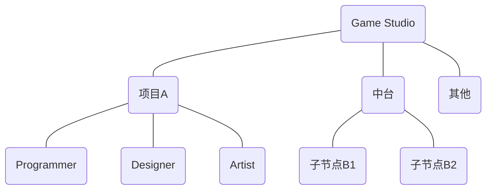
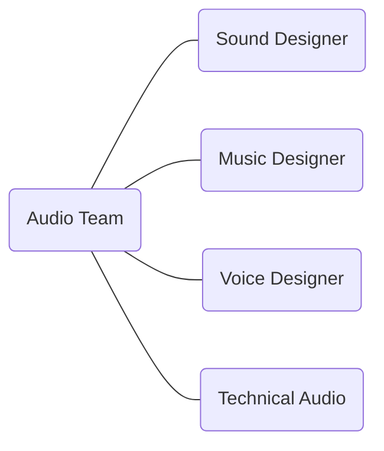

## 游戏音频设计概述
**Game Audio Design Overview**

---
layout: default
---

<div class="flex items-center justify-center text-center mt-50">
  <div class="grid grid-cols-3 gap-4">
    <span class="text-red-500 font-bold text-4xl tracking-widest">游戏</span>
    <span class="text-green-500 font-bold text-4xl tracking-widest">音频</span>
    <span class="text-blue-500 font-bold text-4xl tracking-widest">设计</span>
    <span class="text-red-500 font-bold text-2xl tracking-wide">Game</span>
    <span class="text-green-500 font-bold text-2xl tracking-wide">Audio</span>
    <span class="text-blue-500 font-bold text-2xl tracking-wide">Design</span>
  </div>
</div>

<!--概述：游戏·音频·设计-->

---
layout: header-body
---

### <span class="text-red-500">游戏</span>
[电子游戏 Video Game](https://en.wikipedia.org/wiki/Video_game)

::body::

<!--
- 互动媒体
- 趋势：平台之间的性能差距越来越小，多端游戏涌现
-->

---
layout: header-body
---

### <span class="text-red-500">游戏</span>
开发阶段 Dev Stage

::body::

```mermaid {theme: 'neutral', scale: '0.6'}
gantt
```
<!--
开发阶段
-->

---
layout: header-body
---

### <span class="text-red-500">游戏</span>
开发团队 Dev Team

::body::



<!--
音频组在什么位置
音频会跟各个工种和模块打交道：材质、动画、特效、关卡……
-->

---
layout: header-body
---

### <span class="text-red-500">游戏</span>
音频团队 Audio Team

::body::



<!--
- 音频组内部的分工形式
- 技术音频是什么
- 怎么成为 Lead Audio Designer
-->

---
layout: header-body
---

### <span class="text-green-500">音频</span>
音频设计的从头到尾

::body::

<!--
- 音频设计 End-to-End
- 技术与艺术的结合
-->

---
layout: header-body
---

### <span class="text-green-500">音频</span>
技能树

::body::

既有艺术创作方面的制作能力，还有技术思维方面的实现能力。

- 声学基础
- 录音技术
- 数字音频制作
- 声音设计
- 混音
- 游戏设计基础
- 游戏引擎
- 游戏音频中间件
- 技术音频
- ……

<!--
- 结合技能树
-->

---
layout: header-body
---

### <span class="text-blue-500">设计</span>
工作流 Workflow，根据设计需求制作出相应的音频数据，并将其整合到游戏引擎中去，与其它设计元素共同形成最终整体的游戏表现。

::body::


<!--
-->

---
layout: header-body
---

### <span class="text-blue-500">设计</span>
设计的三个考虑层面

::body::

<!--
设计的三个考虑层面：
- 美学
- 功能
- 与游戏类型和玩法机制相结合
-->

---
layout: header-body
---

### <span class="text-blue-500">设计</span>
如何设计“听声辨位”

::body::

<!--
-->

---
layout: statement
---

#### 游戏开发是系统工程，游戏音频设计也应如此。
Game development is like systems engineering, and so is game audio design.