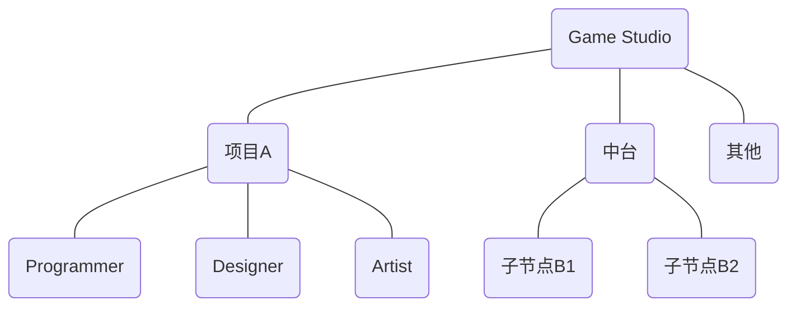
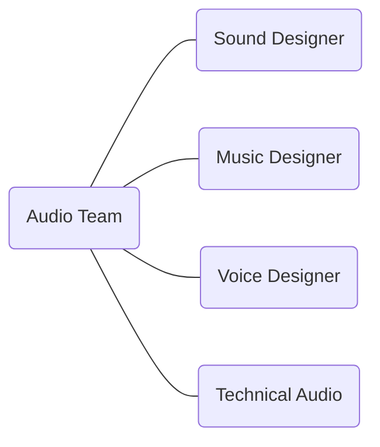

## 游戏音频设计概述
**Game Audio Design Overview**

---
layout: default
---

<div class="flex items-center justify-center text-center mt-50">
  <div class="grid grid-cols-3 gap-4">
    <span class="text-red-500 font-bold text-4xl tracking-widest">游戏</span>
    <span class="text-green-500 font-bold text-4xl tracking-widest">音频</span>
    <span class="text-blue-500 font-bold text-4xl tracking-widest">设计</span>
    <span class="text-red-500 font-bold text-2xl tracking-wide">Game</span>
    <span class="text-green-500 font-bold text-2xl tracking-wide">Audio</span>
    <span class="text-blue-500 font-bold text-2xl tracking-wide">Design</span>
  </div>
</div>

<!--概述：游戏·音频·设计-->

---
layout: header-body
---

### <span class="text-red-500">游戏</span>
[电子游戏 Video Game](https://en.wikipedia.org/wiki/Video_game)

::body::

<!--
- 互动媒体
- 趋势：平台之间的性能差距越来越小，多端游戏涌现
-->

---
layout: header-body
---

### <span class="text-red-500">游戏</span>
开发阶段 Dev Stage

::body::

```mermaid {theme: 'neutral', scale: '0.6'}
gantt
```
<!--
https://www.ubisoft.com/en-us/company/how-we-make-games/creative-process
-->

---
layout: header-body
---

### <span class="text-red-500">游戏</span>
开发团队 Dev Team

::body::



<!--
音频组在什么位置
音频会跟各个工种和模块打交道：材质、动画、特效、关卡……
-->

---
layout: header-body
---

### <span class="text-red-500">游戏</span>
音频团队 Audio Team

::body::



<!--
- 音频组内部的分工形式
- 技术音频是什么
- 怎么成为 Lead Audio Designer
-->

---
layout: header-body
---

### <span class="text-green-500">音频</span>
音效、音乐、语音

::body::

<!--
-->

---
layout: header-body-center
---

### <span class="text-green-500">音频</span>
根据**设计需求**制作出相应的**音频数据**，并将其整合到游戏引擎中去，与其它设计元素共同形成最终整体的**游戏表现**。

::body::


<!--
- 在做出好听的声音之外，还有考虑其他的问题
- 既有艺术创作方面的制作能力，还有技术思维方面的实现能力。
-->

---
layout: header-body
---

### <span class="text-blue-500">设计</span>
Design Workflow

::body::


<!--
游戏音频设计工作流，包含前期设计、功能开发、资源制作、数据整合与测试优化等环节的迭代式开发流程
-->

---
layout: header-body
---

### <span class="text-blue-500">设计</span>
声音的“好听”和“有用”

::body::

- 美学性：与**艺术风格**和**内容表现**相匹配
- 功能性：与**游戏类型**和**玩法机制**相结合

<!--
-->

---
layout: header-body-two-cols
---

### 听声辨位

::left::

<v-clicks>

- 脚步声是玩家获取信息的重要声⾳
- 游戏内各种类别声⾳的听感⼤⼩和传播距离不同
- 声⾳传播时会受到房间、⻔和障碍物的影响
- 玩家能够根据听到的声⾳来判断声源的距离和⽅位

</v-clicks>

::right::


<!--
-->

---
layout: statement
---

#### 游戏开发是系统工程，游戏音频设计也应如此。
Game development is like systems engineering, and so is game audio design.