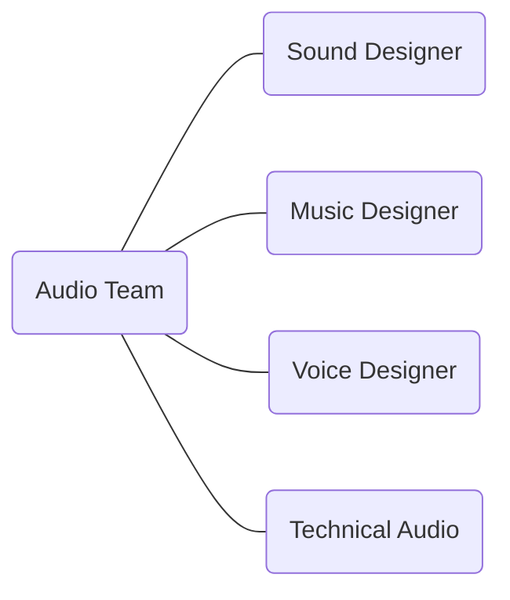
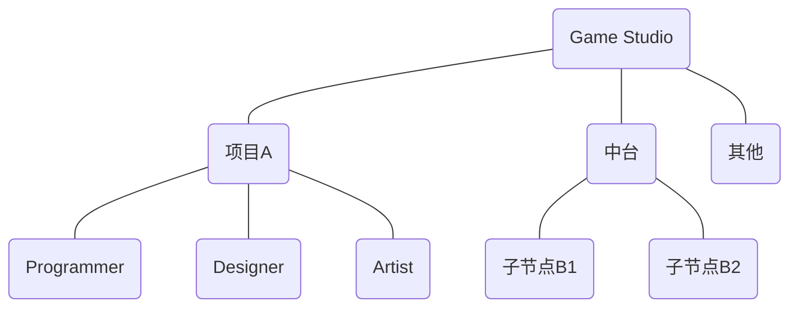
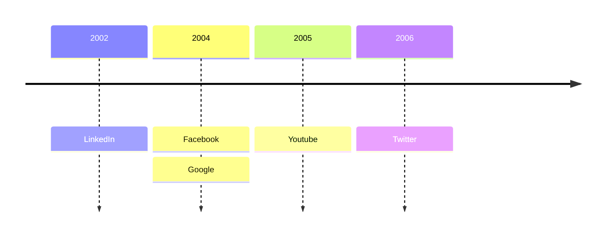

## 游戏音频设计概述
Game Audio Design Overview

---
layout: default
---

  

    游戏
    音频
    设计
    Game
    Audio
    Design
  

<!--概述：游戏·音频·设计-->

---
layout: header-body-center-left
---

### Audio Team

::body::

<!--
- 音频组内部的分工形式
- 技术音频是什么
- 怎么成为 Lead Audio Designer
-->

---
layout: header-body-center-top
---

### Dev Team

::body::

<!--
音频会跟各个工种和模块打交道：材质、动画、特效、关卡……
音频属于哪里？
-->

---
layout: header-body-center
---

### Dev Stage

::body::

<!--
开发环节
-->

---
layout: header-body-center
---

### Dev Tool

::body::

---
layout: statement
---

### 游戏开发是系统工程，游戏音频设计也应如此。
Game development is like systems engineering, and so is game audio design.