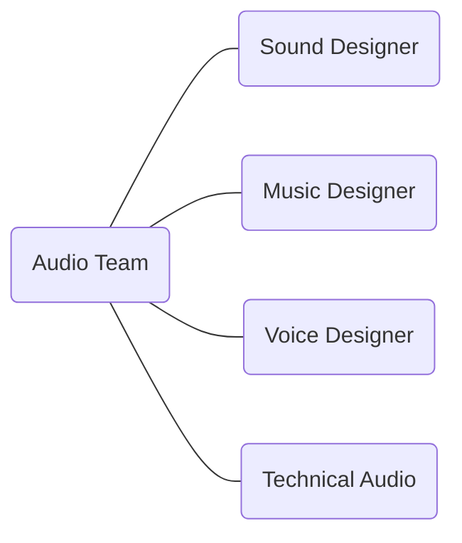
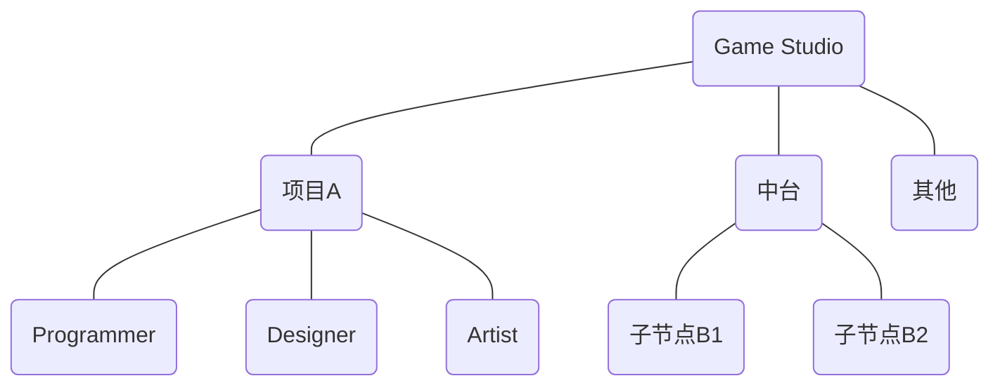
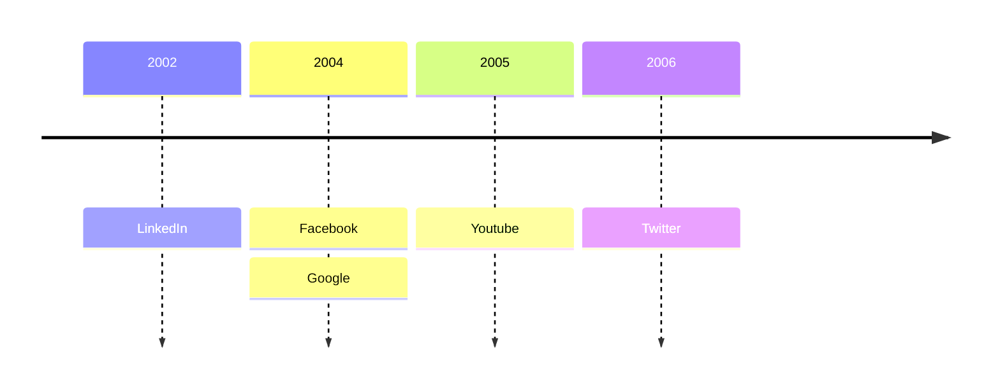

## 游戏音频设计概述
Game Audio Design Overview

---
layout: default
---

  

    游戏
    音频
    设计
    Game
    Audio
    Design
  

<!--概述：游戏·音频·设计-->

---
layout: header-body
---

### 技能树 Skillset
既有艺术创作方面的制作能力，还有技术思维方面的实现能力。

::body::

- 声学基础
- 录音技术
- 数字音频制作
- 声音设计
- 混音
- 游戏设计基础
- 游戏引擎
- 游戏音频中间件
- 技术音频
- ……

---
layout: header-body
---

### 工作流 Workflow
根据设计需求制作出相应的音频数据，并将其整合到游戏引擎中去，与其它设计元素共同形成最终整体的游戏表现。

::body::

---
layout: header-body-center-left
---

### 音频团队 Audio Team

::body::

<!--
- 音频组内部的分工形式
- 技术音频是什么
- 怎么成为 Lead Audio Designer
-->

---
layout: header-body-center-top
---

### 开发团队 Dev Team

::body::

<!--
音频会跟各个工种和模块打交道：材质、动画、特效、关卡……
音频属于哪里？
-->

---
layout: header-body-center
---

### 开发环节 Dev Stage

::body::

<!--
开发环节
-->

---
layout: header-body-center
---

### Dev Tool
Version Control, Game Engine, Game Audio Middleware and Others

::body::

  
   
  

---
layout: header-body-two-cols
---

### AI Tool

::left::

- Natural Language Processing
- Computer Vision
  - Text-to-Image
  - Text-to-Video
  - Text-to-3D
  - Image-to-3D
- Audio
  - Speech Recognition
  - Text-to-Speech
  - Text-to-Music
  - Text-to-Sound
  - Audio-to-Audio
- ...

::right::

---
layout: statement
---

#### 得体地使用优雅的工具。
Use elegent tools decently.

---
layout: statement
---

#### 游戏开发是系统工程，游戏音频设计也应如此。
Game development is like systems engineering, and so is game audio design.