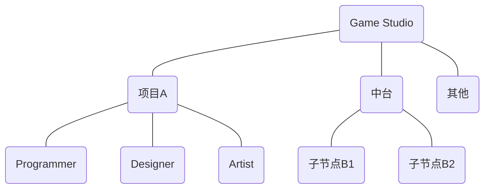
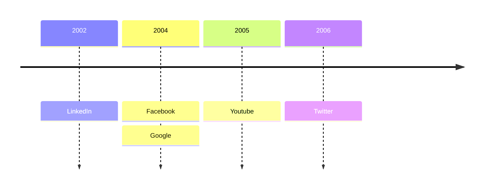

## **游戏开发与游戏音频设计**
**Game Development & Game Audio Design**

---
layout: header-body
---

<!--
游戏·音频·设计
-->

---
layout: header-body-center-top
---

### **Dev Team**

::body::

<!--
音频会跟各个工种和模块打交道：材质、动画、特效、关卡……
音频属于哪里？
-->

---
layout: header-body-center
---

### **Dev Stage**

::body::

<!--
开发环节
-->

---
layout: header-body-center
---

### **Dev Tool**

::body::

---