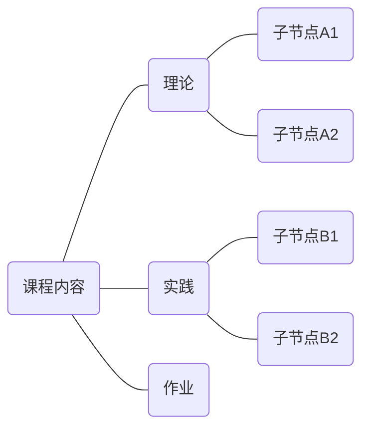
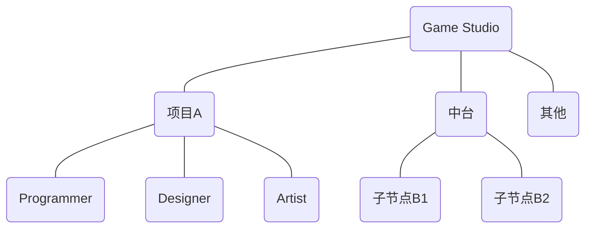
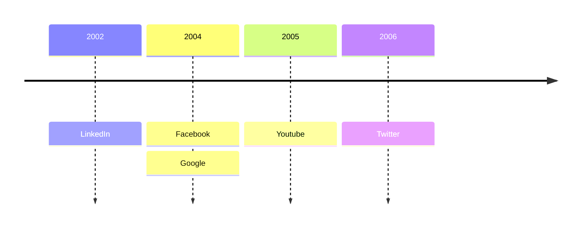

# **游戏音频设计**
## **Game Audio Design**
 
 
Xichen

<!--
The last comment block of each slide will be treated as slide notes.
-->

---
layout: header-body-two-cols
---

### **沈希辰**  
Xichen Shen

::left::

- Lead Audio Designer at Hypergryph  
Aug 2023 - Present  
Unannounced project working in progress...

- Senior Audio Designer at Tencent NExT Studios  
Apr 2019 – Aug 2023  
[SYNCED](https://www.syncedthegame.com)  

- Audio Designer at Ubisoft Shanghai  
Aug 2015 – Apr 2019  
[Far Cry New Dawn](https://www.ubisoft.com/en-us/game/far-cry/new-dawn)  
[Far Cry 5](https://www.ubisoft.com/en-us/game/far-cry/far-cry-5)  
[Far Cry 5 DLC: Hours of Darkness](https://www.ubisoft.com/en-us/game/far-cry/far-cry-5#58nAYWr7wA8hcfzLZs0mne)  
[Far Cry 5 DLC: Lost On Mars](https://www.ubisoft.com/en-us/game/far-cry/far-cry-5#58nAYWr7wA8hcfzLZs0mne)  
[Far Cry Primal](https://www.ubisoft.com/en-us/game/far-cry/far-cry-primal)  

::right::

  
  
  
  

<!--
个人简介
-->

---
layout: header-body
---

## **课程简介**

::body::

- Who is this course for?
- What does this course cover and not cover?
- What you can expect from this course?
- What is expected from you?

<!-- 
现在不缺学习资料，AI，很多东西需要自学
游戏音频设计的哲学 / 框架 / 方法论
做一名专业的开发者，专业体现在哪里？
-->

---
layout: header-body
---

## **课程简介**

::body::

<!-- 
树状图结构待补充
-->

---
layout: default
---

  

    
游戏

    
音频

    
设计

    
Game

    
Audio

    
Design

  

<!--
游戏·音频·设计
-->

---
layout: header-body
---

## **Dev Team**

::body::

<!--
音频会跟各个工种和模块打交道：材质、动画、特效、关卡……
音频属于哪里？
-->

---
layout: header-body
---

## **Dev Stage**

::body::

<!--
开发环节
-->

---
layout: header-body
---

## **Dev Tool**

::body::

  

---
layout: image-right
---

